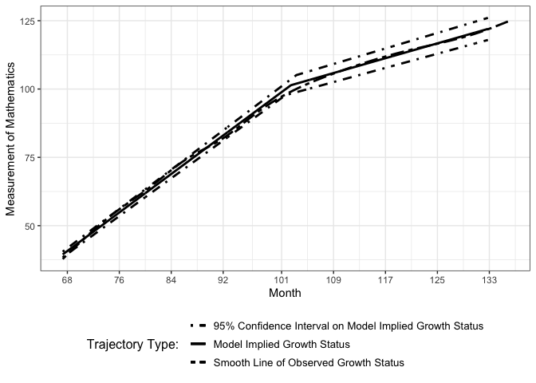
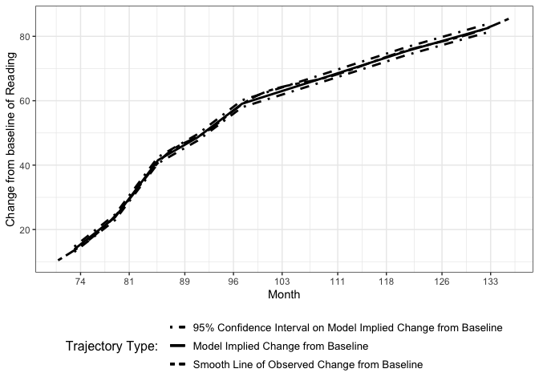
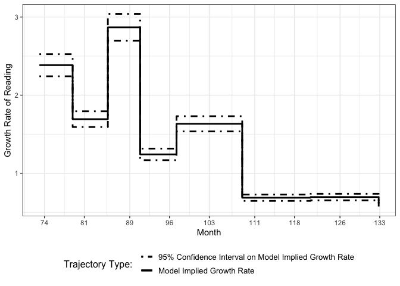
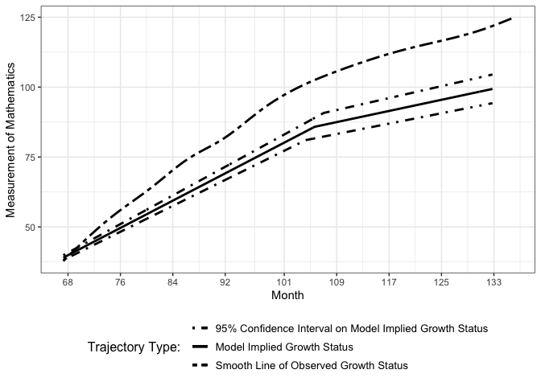
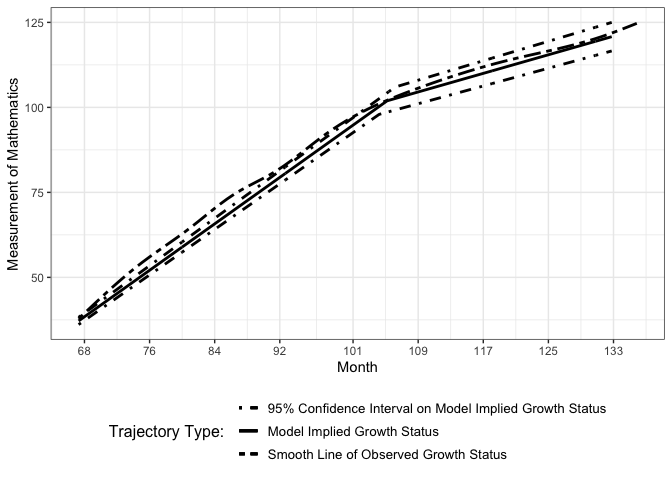
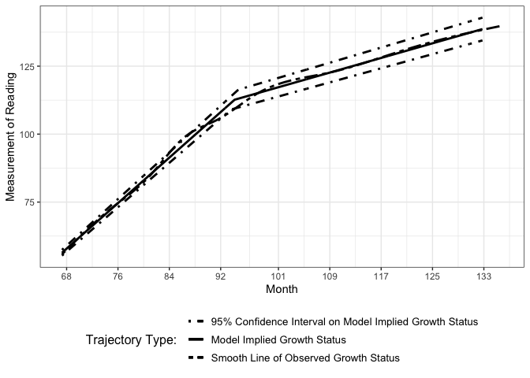
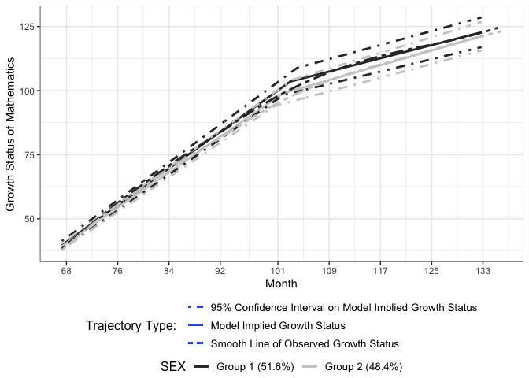
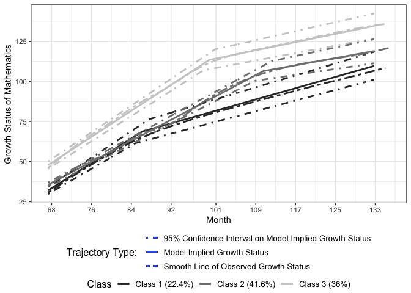

Synthetic Examples for R Package nlpsem
================
Jin Liu

``` r
library(nlpsem)
```

    ## Loading required package: OpenMx

    ## OpenMx may run faster if it is compiled to take advantage of multiple cores.

``` r
devtools::load_all("../../Package/nlpsem")
```

    ## ℹ Loading nlpsem

# Example data

``` r
# Load ECLS-K (2011) data
data("RMS_dat")
RMS_dat0 <- RMS_dat
# Re-baseline the data so that the estimated initial status is for the
# starting point of the study
baseT <- RMS_dat0$T1; xstarts <- mean(baseT)
RMS_dat0$T1 <- RMS_dat0$T1 - baseT
RMS_dat0$T2 <- RMS_dat0$T2 - baseT
RMS_dat0$T3 <- RMS_dat0$T3 - baseT
RMS_dat0$T4 <- RMS_dat0$T4 - baseT
RMS_dat0$T5 <- RMS_dat0$T5 - baseT
RMS_dat0$T6 <- RMS_dat0$T6 - baseT
RMS_dat0$T7 <- RMS_dat0$T7 - baseT
RMS_dat0$T8 <- RMS_dat0$T8 - baseT
RMS_dat0$T9 <- RMS_dat0$T9 - baseT
# Standardize time-invariant covariates (TICs)
## ex1 and ex2 are standardized growth TICs in models
RMS_dat0$ex1 <- scale(RMS_dat0$Approach_to_Learning)
RMS_dat0$ex2 <- scale(RMS_dat0$Attention_focus)
## gx1 and gx2 are standardized cluster TICs in models
RMS_dat0$gx1 <- scale(RMS_dat0$INCOME)
RMS_dat0$gx2 <- scale(RMS_dat0$EDU)
# Standardize time-varying covariate (TVC)
BL_mean <- mean(RMS_dat0[, "R1"])
BL_var <- var(RMS_dat0[, "R1"])
RMS_dat0$Rs1 <- (RMS_dat0$R1 - BL_mean)/sqrt(BL_var)
RMS_dat0$Rs2 <- (RMS_dat0$R2 - BL_mean)/sqrt(BL_var)
RMS_dat0$Rs3 <- (RMS_dat0$R3 - BL_mean)/sqrt(BL_var)
RMS_dat0$Rs4 <- (RMS_dat0$R4 - BL_mean)/sqrt(BL_var)
RMS_dat0$Rs5 <- (RMS_dat0$R5 - BL_mean)/sqrt(BL_var)
RMS_dat0$Rs6 <- (RMS_dat0$R6 - BL_mean)/sqrt(BL_var)
RMS_dat0$Rs7 <- (RMS_dat0$R7 - BL_mean)/sqrt(BL_var)
RMS_dat0$Rs8 <- (RMS_dat0$R8 - BL_mean)/sqrt(BL_var)
RMS_dat0$Rs9 <- (RMS_dat0$R9 - BL_mean)/sqrt(BL_var)
head(RMS_dat0)
```

    ##           ID      R1       R2       R3       R4       R5       R6       R7
    ## 14  10000014 61.0533  71.0552  78.5028 109.9882 112.6338 119.0805 131.0204
    ## 29  10000029 58.7342  63.3107  87.4390 108.3098 117.8031 124.4843 123.0577
    ## 47  10000047 51.5844  66.6677  67.5425  81.5954  92.1793 104.7755 112.0417
    ## 66  10000066 53.6920  61.6393  74.8572  91.1721 105.4468 122.3648 126.2234
    ## 95  10000095 54.8889  73.2573  77.7501 107.0961 113.7871 108.4502 127.0300
    ## 129 10000129 91.2245 107.1388 120.3719 136.5753 137.1338 139.9153 140.1828
    ##           R8       R9      M1      M2      M3      M4       M5       M6
    ## 14  143.4052 137.0652 51.2953 50.6399 57.3925 80.1414  85.2682  94.1731
    ## 29  126.5784 137.9527 44.1411 54.3557 64.7107 82.9958  83.2294 106.2275
    ## 47  121.5341 140.2891 30.9925 44.7628 47.0755 57.7788  66.8194  78.5502
    ## 66  141.0226 148.8337 24.6459 47.0937 56.6954 69.5438  76.1157  86.6673
    ## 95  132.5852 136.9246 29.6065 50.2221 61.0513 81.7005  77.4089  95.1059
    ## 129 152.3430 155.9560 60.4633 74.5698 82.6556 83.0306 110.9810 119.8762
    ##           M7       M8       M9      S2      S3      S4      S5      S6      S7
    ## 14  106.1280 115.0474 125.8766 24.6497 30.4830 32.3496 40.9454 46.5182 65.5331
    ## 29  123.4263 132.7925 127.5096 35.8322 43.7028 40.6455 47.7815 53.1821 60.4607
    ## 47   94.3809  99.7010 115.3470 41.2768 46.7668 42.0820 43.3976 55.4341 73.3641
    ## 66  122.5060 118.6628 131.0051 43.2319 53.8406 59.3788 56.0984 61.3869 77.8254
    ## 95  109.7579 118.7727 120.9763 43.4005 46.8256 50.2495 47.4000 55.3191 68.1581
    ## 129 119.4172 122.1821 136.5360 47.8725 63.9814 66.4430 68.9873 73.0444 78.6502
    ##          S8      S9 T1   T2    T3    T4    T5    T6    T7    T8    T9 SEX RACE
    ## 14  69.0916 75.9290  0 4.08 10.36 18.12 23.91 29.69 39.03 54.05 65.07   1    1
    ## 29  77.6913 68.3381  0 5.76 11.54 17.46 23.28 29.92 41.00 53.92 65.89   2    1
    ## 47  80.3503 82.6842  0 6.02 11.77 17.73 23.77 29.73 42.51 53.53 64.57   1    1
    ## 66  79.7523 86.9595  0 6.68 11.94 18.12 23.94 30.51 43.53 54.61 67.50   1    3
    ## 95  58.9861 82.4376  0 5.29 11.74 17.95 23.90 30.31 42.41 53.43 67.43   2    1
    ## 129 82.9082 89.5211  0 5.69 11.94 17.62 24.07 29.62 41.66 53.56 65.56   2    8
    ##     LOCALE INCOME SCHOOL_TYPE Approach_to_Learning Self_control Interpersonal
    ## 14       2     17           1               3.1667       3.6667           3.2
    ## 29       1      8           1               2.8571       3.0000           3.2
    ## 47       1     17           1               2.5714       3.5000           4.0
    ## 66       1     18           2               2.2857       3.0000           3.2
    ## 95       2     16           1               3.5714       3.5000           3.4
    ## 129      4     18           1               3.7143       3.3333           3.2
    ##     External_prob_Behavior Internal_prob_Behavior Attention_focus
    ## 14                     1.0                   1.00          5.5000
    ## 29                     2.0                   1.00          6.0000
    ## 47                     1.6                   1.00          4.5000
    ## 66                     1.6                   1.25          4.8333
    ## 95                     1.0                   1.00          5.5000
    ## 129                    1.0                   1.00          7.0000
    ##     Inhibitory_Ctrl EDU        ex1         ex2        gx1        gx2
    ## 14           6.8000   5  0.1827911  0.51616548  0.9808159 -0.1505668
    ## 29           4.3333   5 -0.3144371  0.92312846 -0.7372345 -0.1505668
    ## 47           2.6667   5 -0.7732811 -0.29776049  0.9808159 -0.1505668
    ## 66           3.5000   6 -1.2321251 -0.02647897  1.1717104  0.3513226
    ## 95           6.0000   6  0.8327532  0.51616548  0.7899214  0.3513226
    ## 129          6.0000   8  1.0622555  1.73705443  1.1717104  1.3551014
    ##             Rs1       Rs2      Rs3      Rs4      Rs5      Rs6      Rs7      Rs8
    ## 14   0.48312698 1.3656884 2.022860 4.801112 5.034558 5.603411 6.656981 7.749808
    ## 29   0.27849104 0.6823186 2.811385 4.653011 5.490694 6.080239 5.954357 6.265021
    ## 47  -0.35240288 0.9785382 1.055730 2.295749 3.229666 4.341147 4.982312 5.819915
    ## 66  -0.16642957 0.5348353 1.701175 3.140791 4.400382 5.893216 6.233696 7.539568
    ## 95  -0.06081585 1.5600004 1.956442 4.545915 5.136325 4.665400 6.304870 6.795058
    ## 129  3.14541497 4.5496829 5.717363 7.147141 7.196423 7.441861 7.465465 8.538474
    ##          Rs9
    ## 14  7.190370
    ## 29  7.268682
    ## 47  7.474845
    ## 66  8.228815
    ## 95  7.177963
    ## 129 8.857282

## getLGCM example

``` r
mxOption(model = NULL, key = "Default optimizer", "CSOLNP", reset = FALSE)
# LGCM_TICs, Bilinear Spline Functional Form, Random knot
Math_LGCM_BLS_f <- getLGCM(
  dat = RMS_dat0, t_var = "T", y_var = "M", curveFun = "bilinear spline",
  intrinsic = TRUE, records = 1:9, growth_TIC = NULL, res_scale = 0.1
)@mxOutput
```

    ## Running LGCM, Bilinear Spline Functional Form, Random knot with 15 parameters

``` r
# LGCM_TICs, Bilinear Spline Functional Form, Fixed knot
Math_LGCM_BLS_r <- getLGCM(
  dat = RMS_dat0, t_var = "T", y_var = "M", curveFun = "bilinear spline",
  intrinsic = FALSE, records = 1:9, growth_TIC = NULL, res_scale = 0.1
)@mxOutput
```

    ## Running LGCM, Bilinear Spline Functional Form, Fixed knot with 11 parameters

``` r
# Perform LRT to compare two models
getLRT(full = Math_LGCM_BLS_f, reduced = Math_LGCM_BLS_r, boot = FALSE,
       rep = NA)
```

    ##               # of Free Param -2loglik Degree of Freedom Diff in loglik
    ## Full Model                 15 31261.60              4485             NA
    ## Reduced Model              11 31347.39              4489       85.78891
    ##               Diff in DoF p.values      AIC      BIC
    ## Full Model             NA     <NA> 31291.60 31354.82
    ## Reduced Model           4  <0.0001 31369.39 31415.75

``` r
# Figure of Growth Status of LGCM_TICs, Bilinear Spline Functional Form, random knot
Figure1 <- getFigure(
  model = Math_LGCM_BLS_f, nClass = NULL, cluster_TIC = NULL, sub_Model = "LGCM",
  y_var = "M", curveFun = "BLS", y_model = "LGCM", t_var = "T", records = 1:9,
  m_var = NULL, x_var = NULL, x_type = NULL, xstarts = xstarts, xlab = "Month",
  outcome = "Mathematics"
)
```

    ## Treating first argument as an object that stores a character

``` r
show(Figure1)
```

    ## figOutput Object
    ## --------------------
    ## Trajectories: 1 
    ## Figure 1:

    ## `geom_smooth()` using method = 'gam' and formula = 'y ~ s(x, bs = "cs")'

<!-- -->

``` r
# Figure of Growth Status of LGCM_TICs, Bilinear Spline Functional Form, fixed knot
Figure2 <- getFigure(
  model = Math_LGCM_BLS_r, nClass = NULL, cluster_TIC = NULL, sub_Model = "LGCM",
  
  y_var = "M", curveFun = "BLS", y_model = "LGCM", t_var = "T", records = 1:9,
  m_var = NULL, x_var = NULL, x_type = NULL, xstarts = xstarts, xlab = "Month",
  outcome = "Mathematics"
)
```

    ## Treating first argument as an object that stores a character

``` r
show(Figure2)
```

    ## figOutput Object
    ## --------------------
    ## Trajectories: 1 
    ## Figure 1:

    ## `geom_smooth()` using method = 'gam' and formula = 'y ~ s(x, bs = "cs")'

<!-- -->

## getLCSM example

``` r
mxOption(model = NULL, key = "Default optimizer", "CSOLNP", reset = FALSE)
# LCSM, Nonparametric Functional Form
paraNonP_LCSM <- c(
  "mueta0", "mueta1", paste0("psi", c("00", "01", "11")), paste0("rel_rate", 2:8),
  "residuals", paste0("slp_val_est", 1:8), paste0("slp_var_est", 1:8),
  paste0("chg_inv_val_est", 1:8), paste0("chg_inv_var_est", 1:8),
  paste0("chg_bl_val_est", 1:8), paste0("chg_bl_var_est", 1:8)
)
Read_LCSM_NonP <- getLCSM(
  dat = RMS_dat0, t_var = "T", y_var = "R", curveFun = "nonparametric",
  intrinsic = FALSE, records = 1:9, growth_TIC = NULL, res_scale = 0.1, 
  paramOut = TRUE, names = paraNonP_LCSM
)@mxOutput
```

    ## Running LCSM, Nonparametric Functional Form with 13 parameters

    ## Treating first argument as an expression
    ## Treating first argument as an expression
    ## Treating first argument as an expression
    ## Treating first argument as an expression
    ## Treating first argument as an expression
    ## Treating first argument as an expression
    ## Treating first argument as an expression
    ## Treating first argument as an expression
    ## Treating first argument as an expression
    ## Treating first argument as an expression

``` r
# LCSM_TIC, Nonparametric Functional Form
paraNonP_LCSM_TIC <- c(
  "alpha0", "alpha1", paste0("psi", c("00", "01", "11")), paste0("rel_rate", 2:8),
  "residuals", paste0("beta1", c(0:1)), paste0("beta2", c(0:1)),
  paste0("mux", 1:2), paste0("phi", c("11", "12", "22")), "mueta0", "mueta1",
  paste0("slp_val_est", 1:8), paste0("slp_var_est", 1:8),
  paste0("chg_inv_val_est", 1:8), paste0("chg_inv_var_est", 1:8),
  paste0("chg_bl_val_est", 1:8), paste0("chg_bl_var_est", 1:8)
)
Read_LCSM_NonP_TIC <- getLCSM(
  dat = RMS_dat0, t_var = "T", y_var = "R", curveFun = "nonparametric",
  intrinsic = FALSE, records = 1:9, growth_TIC = c("ex1", "ex2"), res_scale = 0.1, 
  paramOut = TRUE, names = paraNonP_LCSM_TIC
)
```

    ## Running LCSM_TICs, Nonparametric Functional Form with 22 parameters
    ## Treating first argument as an expression
    ## Treating first argument as an expression
    ## Treating first argument as an expression
    ## Treating first argument as an expression
    ## Treating first argument as an expression
    ## Treating first argument as an expression
    ## Treating first argument as an expression
    ## Treating first argument as an expression
    ## Treating first argument as an expression
    ## Treating first argument as an expression
    ## Treating first argument as an expression
    ## Treating first argument as an expression

``` r
Read_LCSM_NonP_TIC_o <- Read_LCSM_NonP_TIC@mxOutput
Read_LCSM_NonP_TIC_e <- Read_LCSM_NonP_TIC@Estimates
# Get summary of two LCSMs with Nonparametric Functional Form
getSummary(model_list = list(Read_LCSM_NonP, Read_LCSM_NonP_TIC_o))
```

    ##    Model No_Params     -2ll      AIC      BIC Y_residuals
    ## 1 Model1        13 32288.39 32314.39 32369.18     45.1379
    ## 2 Model2        22 34575.48 34619.48 34712.20     45.1411

``` r
# Figure of LCSM, Nonparametric Functional Form
Figure3 <- getFigure(
  model = Read_LCSM_NonP, sub_Model = "LCSM", y_var = "R", curveFun = "NonP", 
  y_model = "LCSM", t_var = "T", records = 1:9, xstarts = xstarts, xlab = "Month",
  outcome = "Reading"
)
```

    ## Treating first argument as an object that stores a character

    ## Treating first argument as an object that stores a character
    ## Treating first argument as an object that stores a character

``` r
show(Figure3)
```

    ## figOutput Object
    ## --------------------
    ## Trajectories: 1 
    ## Figure 1:

    ## `geom_smooth()` using method = 'gam' and formula = 'y ~ s(x, bs = "cs")'

<!-- -->

    ## Figure 2:

<!-- -->

``` r
# Three types of confidence intervals of LCSM_TIC, Nonparametric Functional Form
mxOption(model = NULL, key = "Default optimizer", "SLSQP", reset = FALSE)
set.seed(20181022)
getEstimateStats(
  model = Read_LCSM_NonP_TIC_o, est_in = Read_LCSM_NonP_TIC_e, 
  CI_type = "all", rep = 1000
)
```

    ## Running LCSM_TICs, Nonparametric Functional Form with 22 parameters
    
    ## 
    ## Solution found

    ## Final run, for Hessian and/or standard errors and/or confidence intervals

    ## Running LCSM_TICs, Nonparametric Functional Form with 22 parameters

    ## 
    ##  Solution found!  Final fit=34575.481 (started at 34575.481)  (1 attempt(s): 1 valid, 0 errors)

    ##  Start values from best fit:

    ## 2.85883409700569,-0.0307496026751804,2.1025663783895,0.0440098031099053,0.713676185595299,1.20587366575918,0.522769630143677,0.686992719429958,0.28881349104938,0.292348502506442,0.257050333099811,45.1410685313468,0.998000378893206,0.775938390248828,0.997999457539472,136.166031046614,-1.16963402927011,0.10763984621645,-7.99703749780419e-07,-8.27405384007255e-07,55.5595508202301,2.37720003925522

    ## Running LCSM_TICs, Nonparametric Functional Form with 22 parameters

    ## An object of class "StatsOutput"
    ## Slot "wald":
    ##                  Estimate      SE p.value wald_lbound wald_ubound
    ## alpha0            55.5596  0.6005 <0.0001     54.3826     56.7366
    ## alpha1             2.3772  0.0724 <0.0001      2.2353      2.5191
    ## psi00            136.1660  9.8748 <0.0001    116.8117    155.5203
    ## psi01             -1.1696  0.2349 <0.0001     -1.6300     -0.7092
    ## psi11              0.1076  0.0113 <0.0001      0.0855      0.1297
    ## rel_rate2          0.7137  0.0435 <0.0001      0.6284      0.7990
    ## rel_rate3          1.2059  0.0459 <0.0001      1.1159      1.2959
    ## rel_rate4          0.5228  0.0339 <0.0001      0.4564      0.5892
    ## rel_rate5          0.6870  0.0339 <0.0001      0.6206      0.7534
    ## rel_rate6          0.2888  0.0174 <0.0001      0.2547      0.3229
    ## rel_rate7          0.2923  0.0170 <0.0001      0.2590      0.3256
    ## rel_rate8          0.2570  0.0166 <0.0001      0.2245      0.2895
    ## residuals         45.1411  1.0797 <0.0001     43.0249     47.2573
    ## beta10             2.8588  0.8811  0.0012      1.1319      4.5857
    ## beta11            -0.0307  0.0273  0.2608     -0.0842      0.0228
    ## beta20             2.1026  0.8775  0.0166      0.3827      3.8225
    ## beta21             0.0440  0.0273   0.107     -0.0095      0.0975
    ## mux1               0.0000  0.0447 >0.9999     -0.0876      0.0876
    ## mux2               0.0000  0.0447 >0.9999     -0.0876      0.0876
    ## phi11              0.9980  0.0631 <0.0001      0.8743      1.1217
    ## phi12              0.7759  0.0565 <0.0001      0.6652      0.8866
    ## phi22              0.9980  0.0631 <0.0001      0.8743      1.1217
    ## mueta0            55.5595  0.6359 <0.0001     54.3132     56.8058
    ## mueta1             2.3772  0.0724 <0.0001      2.2353      2.5191
    ## slp_val_est1       2.3772  0.0724 <0.0001      2.2353      2.5191
    ## slp_val_est2       1.6966  0.0700 <0.0001      1.5594      1.8338
    ## slp_val_est3       2.8666  0.0684 <0.0001      2.7325      3.0007
    ## slp_val_est4       1.2427  0.0721 <0.0001      1.1014      1.3840
    ## slp_val_est5       1.6331  0.0651 <0.0001      1.5055      1.7607
    ## slp_val_est6       0.6866  0.0362 <0.0001      0.6156      0.7576
    ## slp_val_est7       0.6950  0.0349 <0.0001      0.6266      0.7634
    ## slp_val_est8       0.6111  0.0352 <0.0001      0.5421      0.6801
    ## slp_var_est1       0.1076  0.0113 <0.0001      0.0855      0.1297
    ## slp_var_est2       0.0548  0.0065 <0.0001      0.0421      0.0675
    ## slp_var_est3       0.1565  0.0156 <0.0001      0.1259      0.1871
    ## slp_var_est4       0.0294  0.0042 <0.0001      0.0212      0.0376
    ## slp_var_est5       0.0508  0.0060 <0.0001      0.0390      0.0626
    ## slp_var_est6       0.0090  0.0012 <0.0001      0.0066      0.0114
    ## slp_var_est7       0.0092  0.0012 <0.0001      0.0068      0.0116
    ## slp_var_est8       0.0071  0.0010 <0.0001      0.0051      0.0091
    ## chg_inv_val_est1  13.8240  0.4211 <0.0001     12.9987     14.6493
    ## chg_inv_val_est2   9.9338  0.4097 <0.0001      9.1308     10.7368
    ## chg_inv_val_est3  17.7667  0.4237 <0.0001     16.9363     18.5971
    ## chg_inv_val_est4   7.0613  0.4099 <0.0001      6.2579      7.8647
    ## chg_inv_val_est5  10.4670  0.4172 <0.0001      9.6493     11.2847
    ## chg_inv_val_est6   7.9308  0.4186 <0.0001      7.1104      8.7512
    ## chg_inv_val_est7   8.3602  0.4203 <0.0001      7.5364      9.1840
    ## chg_inv_val_est8   7.3259  0.4215 <0.0001      6.4998      8.1520
    ## chg_inv_var_est1   3.6401  0.3829 <0.0001      2.8896      4.3906
    ## chg_inv_var_est2   1.8796  0.2218 <0.0001      1.4449      2.3143
    ## chg_inv_var_est3   6.0125  0.5980 <0.0001      4.8404      7.1846
    ## chg_inv_var_est4   0.9498  0.1368 <0.0001      0.6817      1.2179
    ## chg_inv_var_est5   2.0868  0.2456 <0.0001      1.6054      2.5682
    ## chg_inv_var_est6   1.1981  0.1623 <0.0001      0.8800      1.5162
    ## chg_inv_var_est7   1.3313  0.1751 <0.0001      0.9881      1.6745
    ## chg_inv_var_est8   1.0223  0.1471 <0.0001      0.7340      1.3106
    ## chg_bl_val_est1   13.8240  0.4211 <0.0001     12.9987     14.6493
    ## chg_bl_val_est2   23.7578  0.4419 <0.0001     22.8917     24.6239
    ## chg_bl_val_est3   41.5246  0.4908 <0.0001     40.5626     42.4866
    ## chg_bl_val_est4   48.5858  0.5144 <0.0001     47.5776     49.5940
    ## chg_bl_val_est5   59.0528  0.5565 <0.0001     57.9621     60.1435
    ## chg_bl_val_est6   66.9836  0.5901 <0.0001     65.8270     68.1402
    ## chg_bl_val_est7   75.3438  0.6287 <0.0001     74.1116     76.5760
    ## chg_bl_val_est8   82.6698  0.6637 <0.0001     81.3690     83.9706
    ## chg_bl_var_est1    3.6401  0.3829 <0.0001      2.8896      4.3906
    ## chg_bl_var_est2   10.7512  0.9991 <0.0001      8.7930     12.7094
    ## chg_bl_var_est3   32.8437  2.9315 <0.0001     27.0981     38.5893
    ## chg_bl_var_est4   44.9637  3.9800 <0.0001     37.1630     52.7644
    ## chg_bl_var_est5   66.4238  5.8517 <0.0001     54.9547     77.8929
    ## chg_bl_var_est6   85.4633  7.4952 <0.0001     70.7730    100.1536
    ## chg_bl_var_est7  108.1279  9.4500 <0.0001     89.6062    126.6496
    ## chg_bl_var_est8  130.1774 11.3692 <0.0001    107.8942    152.4606
    ## 
    ## Slot "likelihood":
    ##             Estimate lik_lbound lik_ubound
    ## beta01        2.8588     1.1069     4.6111
    ## beta11       -0.0307    -0.0847     0.0205
    ## beta02        2.1026     0.3505     3.8544
    ## beta12        0.0440    -0.0073     0.0980
    ## Y_rel_rate2   0.7137     0.6318     0.8034
    ## Y_rel_rate3   1.2059     1.1198     1.3007
    ## Y_rel_rate4   0.5228     0.4581     0.5913
    ## Y_rel_rate5   0.6870     0.6227     0.7562
    ## Y_rel_rate6   0.2888     0.2555     0.3241
    ## Y_rel_rate7   0.2923     0.2599     0.3268
    ## Y_rel_rate8   0.2571     0.2253     0.2905
    ## Y_residuals  45.1411    43.0795    47.3331
    ## phi1          0.9980     0.8833     1.1334
    ## phi2          0.7759     0.6730     0.8963
    ## phi3          0.9980     0.8833     1.1334
    ## Y_psi00     136.1660   118.2743   157.2625
    ## Y_psi01      -1.1696    -1.5725    -0.7773
    ## Y_psi11       0.1076     0.0876     0.1316
    ## mux1          0.0000    -0.0877     0.0877
    ## mux2          0.0000    -0.0877     0.0877
    ## Y_mueta0     55.5596    54.3749    56.7388
    ## Y_mueta1      2.3772     2.2348     2.5198
    ## 
    ## Slot "bootstrap":
    ##             Estimate boot_lbound boot_ubound
    ## beta01        2.8588      1.1640      4.4200
    ## beta11       -0.0307     -0.0845      0.0170
    ## beta02        2.1026      0.4246      3.7234
    ## beta12        0.0440     -0.0150      0.1022
    ## Y_rel_rate2   0.7137      0.6476      0.7835
    ## Y_rel_rate3   1.2059      1.1188      1.2912
    ## Y_rel_rate4   0.5228      0.4618      0.5840
    ## Y_rel_rate5   0.6870      0.6259      0.7470
    ## Y_rel_rate6   0.2888      0.2566      0.3236
    ## Y_rel_rate7   0.2923      0.2642      0.3214
    ## Y_rel_rate8   0.2570      0.2304      0.2871
    ## Y_residuals  45.1411     42.3520     48.0030
    ## phi1          0.9980      0.8918      1.1049
    ## phi2          0.7759      0.6696      0.8801
    ## phi3          0.9980      0.8759      1.1089
    ## Y_psi00     136.1660    106.7621    166.3167
    ## Y_psi01      -1.1696     -1.9469     -0.5296
    ## Y_psi11       0.1076      0.0857      0.1321
    ## mux1          0.0000     -0.0878      0.0811
    ## mux2          0.0000     -0.0881      0.0864
    ## Y_mueta0     55.5596     54.6802     56.5723
    ## Y_mueta1      2.3772      2.2658      2.4974

# getTVCmodel example

``` r
mxOption(model = NULL, key = "Default optimizer", "CSOLNP", reset = FALSE)
# LGCM with TVC and TICs, Bilinear Spline Functional Form (random knot)
set.seed(20191029)
Math_TVC_BLS_f <- getTVCmodel(
  dat = RMS_dat0, t_var = "T", y_var = "M", curveFun = "BLS", intrinsic = TRUE, 
  records = 1:9, y_model = "LGCM", TVC = "Rs", decompose = 0, growth_TIC = "ex1", 
  res_scale = 0.1, tries = 10
)@mxOutput
```

    ## Running LGCM with TVC and TICs, Bilinear Spline Functional Form (random knot) with 40 parameters

    ## 
    ## Beginning initial fit attempt

    ## 
    ## Solution found

    ## 
    ##  Solution found!  Final fit=47225.917 (started at 60071.619)  (1 attempt(s): 1 valid, 0 errors)

    ##  Start values from best fit:

    ## 3.09407135453533,4.00052487393887,0.0012732333979633,-0.0286600015130648,-0.4760918732408,0.997998987872937,1.32953266588073,1.99214572201843,2.10713871792363,2.19049745972963,1.99803883755997,1.63463361162172,1.37973057228329,1.63667532827773,29.9979478070719,0.997999675432673,200.711223386701,1.36605614064205,0.021586012119982,-1.81354174560025,-0.015126043026295,0.025289240393296,-66.649966876316,-0.857335022057669,0.526565168944028,89.6869756938332,-7.01501637224275e-07,1.2407398754983,2.08431432173315,3.66615071934721,4.26506236640926,5.1938702256664,5.90386026723828,6.65870725386153,7.30470894058403,2.14351544766761e-08,85.8118021181104,0.859391802727326,-0.360495859004913,38.3664172155372

``` r
# LGCM with decomposed TVC and TICs, Bilinear Spline Functional Form (random knot)
paraBLS_TVC.f <- c(
  "Y_alpha0", "Y_alpha1", "Y_alpha2", "Y_alphag", 
  paste0("Y_psi", c("00", "01", "02", "0g", "11", "12", "1g", "22", "2g", "gg")), 
  "Y_residuals", "X_mueta0", "X_mueta1", paste0("X_psi", c("00", "01", "11")), 
  paste0("X_rel_rate", 2:8), paste0("X_abs_rate", 1:8), "X_residuals",
  paste0("betaTIC", c(0:2, "g")), paste0("betaTVC", c(0:2, "g")), "muTIC", "phiTIC", 
  "Y_mueta0", "Y_mueta1", "Y_mueta2", "Y_mu_knot", "covBL", "kappa", "Cov_XYres"
)
set.seed(20191029)
Math_TVCslp_BLS_f <- getTVCmodel(
  dat = RMS_dat0, t_var = "T", y_var = "M", curveFun = "BLS", intrinsic = TRUE, 
  records = 1:9, y_model = "LGCM", TVC = "Rs", decompose = 1, growth_TIC = "ex1", 
  res_scale = c(0.1, 0.1), res_cor = 0.3, tries = 10, paramOut = TRUE, 
  names = paraBLS_TVC.f
) 
```

    ## Running LGCM with decomposed TVC and TICs, Bilinear Spline Functional Form (random knot) with 41 parameters

    ## 
    ## Beginning initial fit attempt

    ## 
    ## Solution found

    ## 
    ##  Solution found!  Final fit=42269.243 (started at 54288.21)  (2 attempt(s): 2 valid, 0 errors)

    ##  Start values from best fit:

    ## 1.34257686882115,-0.00380921794386549,-0.0137281691390159,0.0592772034033427,0.694749967828661,1.24786694975187,0.490299432514584,0.711020912914644,0.282347971987861,0.301913402023007,0.256774427522714,10.3083434251795,0.0209628177399582,-0.0498519635684668,-1.52630964297038,21.3466982374272,0.358699988998448,0.550979647600226,28.3921585011715,0.997998520693686,161.088802506069,1.42733635160441,0.0261356401161682,-1.67614803153613,-0.015350656588849,0.0276547703448226,-34.6434309034075,-0.56041503297735,0.235503911458559,42.3164176837446,0.400005292777429,1.21241646441874,-0.0064666664925587,0.000680659025812155,1.99394941814669e-07,101.855861559003,1.19557841811552,-0.511706533389642,0.00932099453476491,0.208633130395664,37.9199480531969

    ## Treating first argument as an object that stores a character
    ## Treating first argument as an object that stores a character
    ## Treating first argument as an object that stores a character
    ## Treating first argument as an object that stores a character
    ## Treating first argument as an object that stores a character
    ## Treating first argument as an object that stores a character
    ## Treating first argument as an object that stores a character
    ## Treating first argument as an object that stores a character

    ## Treating first argument as an expression
    ## Treating first argument as an expression
    ## Treating first argument as an expression
    ## Treating first argument as an expression
    ## Treating first argument as an expression
    ## Treating first argument as an expression
    ## Treating first argument as an expression
    ## Treating first argument as an expression
    ## Treating first argument as an expression
    ## Treating first argument as an expression

``` r
Math_TVCslp_BLS_f_o <- Math_TVCslp_BLS_f@mxOutput
Math_TVCslp_BLS_f_e <- Math_TVCslp_BLS_f@Estimates
# Get Wald confidence intervals for LGCM with decomposed TVC and TICs, Bilinear 
# Spline Functional Form (random knot)
getEstimateStats(est_in = Math_TVCslp_BLS_f_e, CI_type = "Wald")
```

    ## An object of class "StatsOutput"
    ## Slot "wald":
    ##             Estimate     SE p.value wald_lbound wald_ubound
    ## Y_alpha0     37.1157 0.4057 <0.0001     36.3205     37.9109
    ## Y_alpha1      1.7073 0.0171 <0.0001      1.6738      1.7408
    ## Y_alpha2      0.6839 0.0157 <0.0001      0.6531      0.7147
    ## Y_alphag     37.9199 0.5011 <0.0001     36.9378     38.9020
    ## Y_psi00      47.2134 4.1851 <0.0001     39.0108     55.4160
    ## Y_psi01      -0.1004 0.1358  0.4597     -0.3666      0.1658
    ## Y_psi02      -0.1912 0.1246  0.1249     -0.4354      0.0530
    ## Y_psi0g      -4.4622 3.6339  0.2195    -11.5845      2.6601
    ## Y_psi11       0.0845 0.0083 <0.0001      0.0682      0.1008
    ## Y_psi12      -0.0015 0.0055  0.7851     -0.0123      0.0093
    ## Y_psi1g      -0.7959 0.1853 <0.0001     -1.1591     -0.4327
    ## Y_psi22       0.0231 0.0079  0.0035      0.0076      0.0386
    ## Y_psi2g      -0.3249 0.1777  0.0675     -0.6732      0.0234
    ## Y_psigg      42.3164 6.7900 <0.0001     29.0082     55.6246
    ## Y_residuals  28.3922 0.8032 <0.0001     26.8180     29.9664
    ## X_mueta0      0.0093 0.0556  0.8672     -0.0997      0.1183
    ## X_mueta1      0.2086 0.0058 <0.0001      0.1972      0.2200
    ## X_psi00       1.2124 0.0857 <0.0001      1.0444      1.3804
    ## X_psi01      -0.0065 0.0017   1e-04     -0.0098     -0.0032
    ## X_psi11       0.0007 0.0001 <0.0001      0.0005      0.0009
    ## X_rel_rate2   0.6947 0.0384 <0.0001      0.6194      0.7700
    ## X_rel_rate3   1.2479 0.0431 <0.0001      1.1634      1.3324
    ## X_rel_rate4   0.4903 0.0303 <0.0001      0.4309      0.5497
    ## X_rel_rate5   0.7110 0.0330 <0.0001      0.6463      0.7757
    ## X_rel_rate6   0.2823 0.0169 <0.0001      0.2492      0.3154
    ## X_rel_rate7   0.3019 0.0168 <0.0001      0.2690      0.3348
    ## X_rel_rate8   0.2568 0.0165 <0.0001      0.2245      0.2891
    ## X_abs_rate1   0.2086 0.0058 <0.0001      0.1972      0.2200
    ## X_abs_rate2   0.1449 0.0055 <0.0001      0.1341      0.1557
    ## X_abs_rate3   0.2603 0.0055 <0.0001      0.2495      0.2711
    ## X_abs_rate4   0.1023 0.0057 <0.0001      0.0911      0.1135
    ## X_abs_rate5   0.1483 0.0055 <0.0001      0.1375      0.1591
    ## X_abs_rate6   0.0589 0.0032 <0.0001      0.0526      0.0652
    ## X_abs_rate7   0.0630 0.0031 <0.0001      0.0569      0.0691
    ## X_abs_rate8   0.0536 0.0031 <0.0001      0.0475      0.0597
    ## X_residuals   0.3587 0.0088 <0.0001      0.3415      0.3759
    ## betaTIC0      0.9665 0.3904  0.0133      0.2013      1.7317
    ## betaTIC1      0.0099 0.0169   0.558     -0.0232      0.0430
    ## betaTIC2     -0.0175 0.0165  0.2889     -0.0498      0.0148
    ## betaTICg      0.0593 0.4690  0.8994     -0.8599      0.9785
    ## betaTVC0      7.6231 0.3796 <0.0001      6.8791      8.3671
    ## betaTVC1      0.0708 0.0168 <0.0001      0.0379      0.1037
    ## betaTVC2     -0.0289 0.0158  0.0674     -0.0599      0.0021
    ## betaTVCg     -1.5263 0.4644   0.001     -2.4365     -0.6161
    ## muTIC         0.0000 0.0447 >0.9999     -0.0876      0.0876
    ## phiTIC        0.9980 0.0631 <0.0001      0.8743      1.1217
    ## Y_mueta0     37.1868 0.5447 <0.0001     36.1192     38.2544
    ## Y_mueta1      1.7079 0.0171 <0.0001      1.6744      1.7414
    ## Y_mueta2      0.6836 0.0157 <0.0001      0.6528      0.7144
    ## Y_mu_knot    37.9057 0.5006 <0.0001     36.9245     38.8869
    ## covBL         0.4000 0.0523 <0.0001      0.2975      0.5025
    ## kappa        21.3467 1.2692 <0.0001     18.8591     23.8343
    ## Cov_XYres     0.5510 0.0619 <0.0001      0.4297      0.6723
    ## 
    ## Slot "likelihood":
    ## data frame with 0 columns and 0 rows
    ## 
    ## Slot "bootstrap":
    ## data frame with 0 columns and 0 rows

``` r
# Figure of LGCM with TVC and TICs, Bilinear Spline Functional Form (random knot)
Figure4 <- getFigure(
  model = Math_TVC_BLS_f, sub_Model = "TVC", y_var = "M", curveFun = "BLS", 
  y_model = "LGCM", t_var = "T", records = 1:9, xstarts = xstarts, xlab = "Month",
  outcome = "Mathematics"
)
```

    ## Treating first argument as an object that stores a character

``` r
# Figure of LGCM with decomposed TVC and TICs, Bilinear Spline Functional Form (random knot)
Figure5 <- getFigure(
  model = Math_TVCslp_BLS_f_o, sub_Model = "TVC", y_var = "M", curveFun = "BLS", 
  y_model = "LGCM", t_var = "T", records = 1:9, xstarts = xstarts, xlab = "Month",
  outcome = "Mathematics"
)
```

    ## Treating first argument as an object that stores a character

``` r
show(Figure4)
```

    ## figOutput Object
    ## --------------------
    ## Trajectories: 1 
    ## Figure 1:

    ## `geom_smooth()` using method = 'gam' and formula = 'y ~ s(x, bs = "cs")'

<!-- -->

``` r
show(Figure5) 
```

    ## figOutput Object
    ## --------------------
    ## Trajectories: 1 
    ## Figure 1:

    ## `geom_smooth()` using method = 'gam' and formula = 'y ~ s(x, bs = "cs")'

<!-- -->

# getMGM example

``` r
mxOption(model = NULL, key = "Default optimizer", "CSOLNP", reset = FALSE)
# Multivariate Latent Growth Curve Model, Bilinear Spline (random knot)
paraBLS_PLGCM_f <- c(
  "Y_mueta0", "Y_mueta1", "Y_mueta2", "Y_knot", 
  paste0("Y_psi", c("00", "01", "02", "0g", "11", "12", "1g", "22", "2g", "gg")), 
  "Y_res",
  "Z_mueta0", "Z_mueta1", "Z_mueta2", "Z_knot", 
  paste0("Z_psi", c("00", "01", "02", "0g", "11", "12", "1g", "22", "2g", "gg")), 
  "Z_res",
  paste0("YZ_psi", c(c("00", "10", "20", "g0", "01", "11", "21", "g1",
                       "02", "12", "22", "g2", "0g", "1g", "2g", "gg"))),
  "YZ_res"
)
RM_PLGCM.f <- getMGM(
  dat = RMS_dat0, t_var = c("T", "T"), y_var = c("R", "M"), curveFun = "BLS",
  intrinsic = TRUE, records = list(1:9, 1:9), y_model = "LGCM", res_scale = 
    c(0.1, 0.1), res_cor = 0.3, paramOut = TRUE, names = paraBLS_PLGCM_f
)
```

    ## Running Multivariate Latent Growth Curve Model, Bilinear Spline (random knot) with 47 parameters

    ## Treating first argument as an object that stores a character
    ## Treating first argument as an object that stores a character
    ## Treating first argument as an object that stores a character
    ## Treating first argument as an object that stores a character
    ## Treating first argument as an object that stores a character

``` r
RM_PLGCM.f_o <- RM_PLGCM.f@mxOutput
RM_PLGCM.f_e <- RM_PLGCM.f@Estimates
# Get Wald confidence intervals of the constructed model
getEstimateStats(est_in = RM_PLGCM.f_e, CI_type = "Wald")
```

    ## An object of class "StatsOutput"
    ## Slot "wald":
    ##          Estimate     SE p.value wald_lbound wald_ubound
    ## Y_mueta0  56.3715 0.5378 <0.0001     55.3174     57.4256
    ## Y_mueta1   2.0929 0.0266 <0.0001      2.0408      2.1450
    ## Y_mueta2   0.6730 0.0123 <0.0001      0.6489      0.6971
    ## Y_knot    26.8949 0.2894 <0.0001     26.3277     27.4621
    ## Y_psi00  122.1198 9.1545 <0.0001    104.1773    140.0623
    ## Y_psi01    0.3564 0.3234  0.2704     -0.2775      0.9903
    ## Y_psi02   -0.5796 0.1499   1e-04     -0.8734     -0.2858
    ## Y_psi0g  -23.4848 3.6059 <0.0001    -30.5522    -16.4174
    ## Y_psi11    0.2450 0.0225 <0.0001      0.2009      0.2891
    ## Y_psi12   -0.0350 0.0075 <0.0001     -0.0497     -0.0203
    ## Y_psi1g   -0.8471 0.2076 <0.0001     -1.2540     -0.4402
    ## Y_psi22    0.0216 0.0050 <0.0001      0.0118      0.0314
    ## Y_psi2g    0.2927 0.0866   7e-04      0.1230      0.4624
    ## Y_psigg   10.4961 2.9092   3e-04      4.7942     16.1980
    ## Y_res     38.0996 1.0707 <0.0001     36.0011     40.1981
    ## Z_mueta0  39.4583 0.5207 <0.0001     38.4377     40.4789
    ## Z_mueta1   1.7622 0.0170 <0.0001      1.7289      1.7955
    ## Z_mueta2   0.6813 0.0156 <0.0001      0.6507      0.7119
    ## Z_knot    35.0878 0.4317 <0.0001     34.2417     35.9339
    ## Z_psi00  119.3261 8.5843 <0.0001    102.5012    136.1510
    ## Z_psi01    0.7914 0.1985   1e-04      0.4023      1.1805
    ## Z_psi02   -0.6358 0.1824   5e-04     -0.9933     -0.2783
    ## Z_psi0g  -17.3136 4.9806   5e-04    -27.0754     -7.5518
    ## Z_psi11    0.0954 0.0093 <0.0001      0.0772      0.1136
    ## Z_psi12   -0.0056 0.0060  0.3506     -0.0174      0.0062
    ## Z_psi1g   -0.6384 0.1853   6e-04     -1.0016     -0.2752
    ## Z_psi22    0.0164 0.0083  0.0482      0.0001      0.0327
    ## Z_psi2g   -0.1647 0.1833  0.3689     -0.5240      0.1946
    ## Z_psigg   33.2187 6.3953 <0.0001     20.6841     45.7533
    ## Z_res     31.3926 0.8835 <0.0001     29.6610     33.1242
    ## YZ_psi00  88.5558 7.5042 <0.0001     73.8478    103.2638
    ## YZ_psi10   1.5594 0.3149 <0.0001      0.9422      2.1766
    ## YZ_psi20  -0.6429 0.1454 <0.0001     -0.9279     -0.3579
    ## YZ_psig0 -15.3384 3.4818 <0.0001    -22.1626     -8.5142
    ## YZ_psi01   0.6831 0.2057   9e-04      0.2799      1.0863
    ## YZ_psi11   0.0687 0.0108 <0.0001      0.0475      0.0899
    ## YZ_psi21   0.0018 0.0047  0.7017     -0.0074      0.0110
    ## YZ_psig1  -0.2231 0.1141  0.0505     -0.4467      0.0005
    ## YZ_psi02  -0.4524 0.1882  0.0162     -0.8213     -0.0835
    ## YZ_psi12  -0.0188 0.0094  0.0455     -0.0372     -0.0004
    ## YZ_psi22   0.0018 0.0046  0.6956     -0.0072      0.0108
    ## YZ_psig2   0.2468 0.1194  0.0387      0.0128      0.4808
    ## YZ_psi0g -18.8062 5.1876   3e-04    -28.9737     -8.6387
    ## YZ_psi1g   0.1887 0.2711  0.4864     -0.3426      0.7200
    ## YZ_psi2g   0.1961 0.1280  0.1255     -0.0548      0.4470
    ## YZ_psigg  -1.6773 3.8826  0.6657     -9.2871      5.9325
    ## YZ_res     7.6825 0.7061 <0.0001      6.2986      9.0664
    ## 
    ## Slot "likelihood":
    ## data frame with 0 columns and 0 rows
    ## 
    ## Slot "bootstrap":
    ## data frame with 0 columns and 0 rows

``` r
# Figure of the constructed model
Figure6 <- getFigure(
  model = RM_PLGCM.f_o, sub_Model = "MGM", y_var = c("R", "M"), curveFun = "BLS", 
  y_model = "LGCM", t_var = c("T", "T"), records = list(1:9, 1:9), xstarts = 
    xstarts, xlab = "Month", outcome = c("Reading", "Mathematics")
)
```

    ## Treating first argument as an object that stores a character
    ## Treating first argument as an object that stores a character

``` r
show(Figure6)
```

    ## figOutput Object
    ## --------------------
    ## Trajectories: 2 
    ## 
    ## Trajectory 1 :
    ##   Figure 1:

    ## `geom_smooth()` using method = 'gam' and formula = 'y ~ s(x, bs = "cs")'

<!-- -->

    ## 
    ## Trajectory 2 :
    ##   Figure 1:

    ## `geom_smooth()` using method = 'gam' and formula = 'y ~ s(x, bs = "cs")'

<!-- -->

# getMediation example

``` r
mxOption(model = NULL, key = "Default optimizer", "CSOLNP", reset = FALSE)
# Longitudinal Mediation Model with Baseline Predictor, Bilinear Spline
paraMed2_BLS <- c(
  "muX", "phi11", "alphaM1", "alphaMr", "alphaM2", "mugM",
  paste0("psi", c("M1M1", "M1Mr", "M1M2", "MrMr", "MrM2", "M2M2"), "_r"),
  "alphaY1", "alphaYr", "alphaY2", "mugY",
  paste0("psi", c("Y1Y1", "Y1Yr", "Y1Y2", "YrYr", "YrY2", "Y2Y2"), "_r"),
  paste0("beta", rep(c("M", "Y"), each = 3), rep(c(1, "r", 2), 2)),
  paste0("beta", c("M1Y1", "M1Yr", "M1Y2", "MrYr", "MrY2", "M2Y2")),
  "muetaM1", "muetaMr", "muetaM2", "muetaY1", "muetaYr", "muetaY2", 
  paste0("Mediator", c("11", "1r", "12", "rr", "r2", "22")),
  paste0("total", c("1", "r", "2")),
  "residualsM", "residualsY", "residualsYM"
)
RM_BLS_LGCM <- getMediation(
  dat = RMS_dat0, t_var = rep("T", 2), y_var = "M", m_var = "R", x_type = 
    "baseline", x_var = "ex1", curveFun = "BLS", records = list(1:9, 1:9), 
  res_scale = c(0.1, 0.1), 
  res_cor = 0.3, paramOut = TRUE, names = paraMed2_BLS
)
```

    ## Running Longitudinal Mediation Model with Baseline Predictor, Bilinear Spline with 37 parameters

    ## Treating first argument as an expression
    ## Treating first argument as an expression
    ## Treating first argument as an expression
    ## Treating first argument as an expression
    ## Treating first argument as an expression
    ## Treating first argument as an expression
    ## Treating first argument as an expression
    ## Treating first argument as an expression
    ## Treating first argument as an expression
    ## Treating first argument as an expression
    ## Treating first argument as an expression

``` r
# Get Wald confidence intervals for the constructed model
getEstimateStats(est_in = RM_BLS_LGCM@Estimates, CI_type = "Wald")
```

    ## An object of class "StatsOutput"
    ## Slot "wald":
    ##             Estimate      SE p.value wald_lbound wald_ubound
    ## muX           0.0000  0.0447 >0.9999     -0.0876      0.0876
    ## phi11         0.9980  0.0630 <0.0001      0.8745      1.1215
    ## alphaM1       2.1134  0.0246 <0.0001      2.0652      2.1616
    ## alphaMr     111.8319  0.7841 <0.0001    110.2951    113.3687
    ## alphaM2       0.6878  0.0134 <0.0001      0.6615      0.7141
    ## mugM         26.3108  0.2453 <0.0001     25.8300     26.7916
    ## psiM1M1_r     0.1935  0.0173 <0.0001      0.1596      0.2274
    ## psiM1Mr_r     4.6661  0.4371 <0.0001      3.8094      5.5228
    ## psiM1M2_r    -0.0278  0.0066 <0.0001     -0.0407     -0.0149
    ## psiMrMr_r   226.5296 15.3549 <0.0001    196.4345    256.6247
    ## psiMrM2_r    -1.9011  0.2145 <0.0001     -2.3215     -1.4807
    ## psiM2M2_r     0.0341  0.0045 <0.0001      0.0253      0.0429
    ## alphaY1       0.9622  0.0678 <0.0001      0.8293      1.0951
    ## alphaYr      19.0900  3.1871 <0.0001     12.8434     25.3366
    ## alphaY2       0.3800  0.2432  0.1182     -0.0967      0.8567
    ## mugY         34.7042  0.3575 <0.0001     34.0035     35.4049
    ## psiY1Y1_r     0.0553  0.0062 <0.0001      0.0431      0.0675
    ## psiY1Yr_r     1.7819  0.1920 <0.0001      1.4056      2.1582
    ## psiY1Y2_r    -0.0078  0.0043  0.0697     -0.0162      0.0006
    ## psiYrYr_r   104.2707  7.8922 <0.0001     88.8023    119.7391
    ## psiYrY2_r    -0.7595  0.1566 <0.0001     -1.0664     -0.4526
    ## psiY2Y2_r     0.0235  0.0052 <0.0001      0.0133      0.0337
    ## betaM1        0.0623  0.0231   0.007      0.0170      0.1076
    ## betaMr        5.5471  0.6945 <0.0001      4.1859      6.9083
    ## betaM2       -0.0468  0.0118   1e-04     -0.0699     -0.0237
    ## betaY1        0.0149  0.0139  0.2837     -0.0123      0.0421
    ## betaYr        1.2907  0.5133  0.0119      0.2847      2.2967
    ## betaY2       -0.0212  0.0135  0.1163     -0.0477      0.0053
    ## betaM1Y1      0.3807  0.0317 <0.0001      0.3186      0.4428
    ## betaM1Yr      0.1206  0.9362  0.8975     -1.7143      1.9555
    ## betaM1Y2      0.0548  0.0505  0.2779     -0.0442      0.1538
    ## betaMrYr      0.7277  0.0309 <0.0001      0.6671      0.7883
    ## betaMrY2     -0.0012  0.0020  0.5485     -0.0051      0.0027
    ## betaM2Y2      0.4813  0.1434   8e-04      0.2002      0.7624
    ## muetaM1       2.1134  0.0247 <0.0001      2.0650      2.1618
    ## muetaMr     111.8319  0.8223 <0.0001    110.2202    113.4436
    ## muetaM2       0.6878  0.0136 <0.0001      0.6611      0.7145
    ## muetaY1       1.7667  0.0166 <0.0001      1.7342      1.7992
    ## muetaYr     100.7289  0.8923 <0.0001     98.9800    102.4778
    ## muetaY2       0.6942  0.0172 <0.0001      0.6605      0.7279
    ## Mediator11    0.0237  0.0090  0.0085      0.0061      0.0413
    ## Mediator1r    0.0075  0.0585   0.898     -0.1072      0.1222
    ## Mediator12    0.0034  0.0034  0.3173     -0.0033      0.0101
    ## Mediatorrr    4.0368  0.5298 <0.0001      2.9984      5.0752
    ## Mediatorr2   -0.0066  0.0111  0.5521     -0.0284      0.0152
    ## Mediator22   -0.0225  0.0088  0.0106     -0.0397     -0.0053
    ## total1        0.0386  0.0156  0.0133      0.0080      0.0692
    ## totalr        5.3350  0.6953 <0.0001      3.9722      6.6978
    ## total2       -0.0469  0.0133   4e-04     -0.0730     -0.0208
    ## residualsM   33.8855  1.0615 <0.0001     31.8050     35.9660
    ## residualsY   40.5671  0.8725 <0.0001     38.8570     42.2772
    ## residualsYM   6.9264  0.6861 <0.0001      5.5817      8.2711
    ## 
    ## Slot "likelihood":
    ## data frame with 0 columns and 0 rows
    ## 
    ## Slot "bootstrap":
    ## data frame with 0 columns and 0 rows

``` r
# Longitudinal Mediation Model with Longitudinal Predictor, Bilinear Spline
paraMed3_BLS <- c(
  "muetaX1", "muetaXr", "muetaX2", "mugX", 
  paste0("psi", c("X1X1", "X1Xr", "X1X2", "XrXr", "XrX2", "X2X2")),
  "alphaM1", "alphaMr", "alphaM2", "mugM", 
  paste0("psi", c("M1M1", "M1Mr", "M1M2", "MrMr", "MrM2", "M2M2"), "_r"),
  "alphaY1", "alphaYr", "alphaY2", "mugY", 
  paste0("psi", c("Y1Y1", "Y1Yr", "Y1Y2", "YrYr", "YrY2", "Y2Y2"), "_r"),
  paste0("beta", c("X1Y1", "X1Yr", "X1Y2", "XrYr", "XrY2", "X2Y2",
                   "X1M1", "X1Mr", "X1M2", "XrMr", "XrM2", "X2M2",
                   "M1Y1", "M1Yr", "M1Y2", "MrYr", "MrY2", "M2Y2")),
  "muetaM1", "muetaMr", "muetaM2", "muetaY1", "muetaYr", "muetaY2", 
  paste0("mediator", c("111", "11r", "112", "1rr", "1r2", "122", "rr2", 
                       "r22", "rrr", "222")), paste0("total", c("11", "1r", "12", "rr", "r2", "22")),
  "residualsX", "residualsM", "residualsY", 
  "residualsMX", "residualsYX", "residualsYM"
)
set.seed(20191029)
RMS_BLS_LGCM <- getMediation(
  dat = RMS_dat0, t_var = rep("T", 3), y_var = "S", m_var = "M", x_type = 
    "longitudinal", 
  x_var = "R", curveFun = "bilinear spline", records = list(2:9, 1:9, 1:9), 
  res_scale = c(0.1, 0.1, 0.1),  res_cor = c(0.3, 0.3), tries = 10, paramOut = 
    TRUE, names = paraMed3_BLS)
```

    ## Running Longitudinal Mediation Model with Longitudinal Predictor, Bilinear Spline with 54 parameters

    ## 
    ## Beginning initial fit attempt

    ## 
    ## Solution found

    ## 
    ##  Solution found!  Final fit=87688.848 (started at 91062.774)  (2 attempt(s): 2 valid, 0 errors)

    ##  Start values from best fit:

    ## 0.271847575397195,-2.62442978493605,0.00923024578835769,0.292702847604311,0.00279814778417273,0.373767240992343,0.154022267491296,4.44952645265657,-0.199920015335879,0.398656869689429,0.66765473398168,0.065331976794371,0.196024173355231,0.00901948414316313,0.744536972702349,-0.00202850165345672,0.85291190861869,0.475530993720607,19.4420877258894,33.9661281864922,2.56871978868778,7.00832749753813,41.1750218774748,1.83160622080474,0.0194580832452985,0.509233347304718,36.6572160190914,-0.000967217269513739,-0.365585970896269,0.00793980752282904,0.0544212077133284,1.76699619128153,104.509682571854,-0.00727627760423688,-0.76595122012118,0.0232718627841162,0.189783073011505,5.04878666386517,259.060290146966,-0.0275158853896312,-2.160228773782,0.0341355703435674,0.0432158053824968,0.601634171889865,-1.15001804933864,0.925097261586704,15.9474088031635,0.458212100081306,2.1134447288601,111.843895239827,0.687364851394905,33.6804814379382,34.6341950003673,26.3157299419123

    ## Treating first argument as an expression
    ## Treating first argument as an expression
    ## Treating first argument as an expression
    ## Treating first argument as an expression
    ## Treating first argument as an expression
    ## Treating first argument as an expression
    ## Treating first argument as an expression
    ## Treating first argument as an expression
    ## Treating first argument as an expression
    ## Treating first argument as an expression
    ## Treating first argument as an expression
    ## Treating first argument as an expression
    ## Treating first argument as an expression

``` r
# Get Wald confidence intervals for the constructed model
getEstimateStats(est_in = RMS_BLS_LGCM@Estimates, CI_type = "Wald")
```

    ## An object of class "StatsOutput"
    ## Slot "wald":
    ##             Estimate      SE p.value wald_lbound wald_ubound
    ## muetaX1       2.1134  0.0245 <0.0001      2.0654      2.1614
    ## muetaXr     111.8439  0.8270 <0.0001    110.2230    113.4648
    ## muetaX2       0.6874  0.0135 <0.0001      0.6609      0.7139
    ## mugX         26.3157  0.2478 <0.0001     25.8300     26.8014
    ## psiX1X1       0.1898  0.0174 <0.0001      0.1557      0.2239
    ## psiX1Xr       5.0488  0.4757 <0.0001      4.1164      5.9812
    ## psiX1X2      -0.0275  0.0066 <0.0001     -0.0404     -0.0146
    ## psiXrXr     259.0603 17.8840 <0.0001    224.0083    294.1123
    ## psiXrX2      -2.1602  0.2313 <0.0001     -2.6135     -1.7069
    ## psiX2X2       0.0341  0.0044 <0.0001      0.0255      0.0427
    ## alphaM1       0.9251  0.0670 <0.0001      0.7938      1.0564
    ## alphaMr      15.9474  3.0276 <0.0001     10.0134     21.8814
    ## alphaM2       0.4582  0.2806  0.1025     -0.0918      1.0082
    ## mugM         34.6342  0.3577 <0.0001     33.9331     35.3353
    ## psiM1M1_r     0.0544  0.0063 <0.0001      0.0421      0.0667
    ## psiM1Mr_r     1.7670  0.1998 <0.0001      1.3754      2.1586
    ## psiM1M2_r    -0.0073  0.0042  0.0822     -0.0155      0.0009
    ## psiMrMr_r   104.5097  8.3212 <0.0001     88.2004    120.8190
    ## psiMrM2_r    -0.7660  0.1576 <0.0001     -1.0749     -0.4571
    ## psiM2M2_r     0.0233  0.0051 <0.0001      0.0133      0.0333
    ## alphaY1       0.0432  0.0678   0.524     -0.0897      0.1761
    ## alphaYr       0.6016  1.3882  0.6647     -2.1192      3.3224
    ## alphaY2      -1.1500  0.2806 <0.0001     -1.7000     -0.6000
    ## mugY         33.6805  1.0216 <0.0001     31.6782     35.6828
    ## psiY1Y1_r     0.0195  0.0041 <0.0001      0.0115      0.0275
    ## psiY1Yr_r     0.5092  0.0964 <0.0001      0.3203      0.6981
    ## psiY1Y2_r    -0.0010  0.0028   0.721     -0.0065      0.0045
    ## psiYrYr_r    36.6572  3.3169 <0.0001     30.1562     43.1582
    ## psiYrY2_r    -0.3656  0.0836 <0.0001     -0.5295     -0.2017
    ## psiY2Y2_r     0.0079  0.0041   0.054     -0.0001      0.0159
    ## betaX1Y1      0.3987  0.0313 <0.0001      0.3374      0.4600
    ## betaX1Yr      0.6677  1.2151  0.5827     -1.7139      3.0493
    ## betaX1Y2      0.0653  0.0571  0.2528     -0.0466      0.1772
    ## betaXrYr      0.7445  0.0347 <0.0001      0.6765      0.8125
    ## betaXrY2     -0.0020  0.0023  0.3845     -0.0065      0.0025
    ## betaX2Y2      0.4755  0.1700  0.0052      0.1423      0.8087
    ## betaX1M1      0.1540  0.0371 <0.0001      0.0813      0.2267
    ## betaX1Mr      4.4495  1.2668   4e-04      1.9666      6.9324
    ## betaX1M2     -0.1999  0.0700  0.0043     -0.3371     -0.0627
    ## betaXrMr      0.1960  0.0348 <0.0001      0.1278      0.2642
    ## betaXrM2      0.0090  0.0028  0.0013      0.0035      0.0145
    ## betaX2M2      0.8529  0.1818 <0.0001      0.4966      1.2092
    ## betaM1Y1      0.2718  0.0541 <0.0001      0.1658      0.3778
    ## betaM1Yr     -2.6244  1.5247  0.0852     -5.6128      0.3640
    ## betaM1Y2      0.0092  0.0928   0.921     -0.1727      0.1911
    ## betaMrYr      0.2927  0.0367 <0.0001      0.2208      0.3646
    ## betaMrY2      0.0028  0.0024  0.2433     -0.0019      0.0075
    ## betaM2Y2      0.3738  0.1587  0.0185      0.0628      0.6848
    ## muetaM1       1.7676  0.0166 <0.0001      1.7351      1.8001
    ## muetaMr     100.6304  0.8937 <0.0001     98.8788    102.3820
    ## muetaM2       0.6963  0.0171 <0.0001      0.6628      0.7298
    ## muetaY1       0.8493  0.0131 <0.0001      0.8236      0.8750
    ## muetaYr      56.7453  0.9210 <0.0001     54.9402     58.5504
    ## muetaY2       0.5806  0.0131 <0.0001      0.5549      0.6063
    ## mediator111   0.1084  0.0229 <0.0001      0.0635      0.1533
    ## mediator11r  -1.0462  0.6148  0.0888     -2.2512      0.1588
    ## mediator112   0.0037  0.0370  0.9203     -0.0688      0.0762
    ## mediator1rr   0.1954  0.3497  0.5763     -0.4900      0.8808
    ## mediator1r2   0.0019  0.0039  0.6261     -0.0057      0.0095
    ## mediator122   0.0244  0.0269  0.3644     -0.0283      0.0771
    ## mediatorrr2   0.2179  0.0308 <0.0001      0.1575      0.2783
    ## mediatorr22   0.0021  0.0018  0.2433     -0.0014      0.0056
    ## mediatorrrr  -0.0008  0.0010  0.4237     -0.0028      0.0012
    ## mediator222   0.1777  0.0713  0.0127      0.0380      0.3174
    ## total11       0.2624  0.0273 <0.0001      0.2089      0.3159
    ## total1r       3.5987  1.2804  0.0049      1.0892      6.1082
    ## total12      -0.1700  0.0633  0.0072     -0.2941     -0.0459
    ## totalrr       0.4140  0.0339 <0.0001      0.3476      0.4804
    ## totalr2       0.0103  0.0024 <0.0001      0.0056      0.0150
    ## total22       1.0306  0.1773 <0.0001      0.6831      1.3781
    ## residualsX   41.1750  1.0840 <0.0001     39.0504     43.2996
    ## residualsM   19.4421  0.8803 <0.0001     17.7167     21.1675
    ## residualsY   33.9661  0.5548 <0.0001     32.8787     35.0535
    ## residualsMX   7.0083  0.7114 <0.0001      5.6140      8.4026
    ## residualsYX   1.8316  0.5713  0.0013      0.7119      2.9513
    ## residualsYM   2.5687  0.5551 <0.0001      1.4807      3.6567
    ## 
    ## Slot "likelihood":
    ## data frame with 0 columns and 0 rows
    ## 
    ## Slot "bootstrap":
    ## data frame with 0 columns and 0 rows

# getMGroup example

``` r
mxOption(model = NULL, key = "Default optimizer", "CSOLNP", reset = FALSE)
# Multiple group Growth Models
MGroup_Math_BLS_LGCM_f <-  getMGroup(
  dat = RMS_dat0, grp_var = "SEX", sub_Model = "LGCM", y_var = "M", t_var = "T",
  records = 1:9, curveFun = "BLS", intrinsic = TRUE, res_scale = list(0.1, 0.1)
)@mxOutput
```

    ## Running Multiple group Growth Models with 30 parameters

``` r
# Figure of the constructed model
Figure7 <- getFigure(
  model = MGroup_Math_BLS_LGCM_f, nClass = 2, cluster_TIC = NULL, grp_var = "SEX", 
  sub_Model = "LGCM", y_var = "M", curveFun = "BLS", y_model = "LGCM", t_var = "T", 
  records = 1:9, m_var = NULL, x_var = NULL, x_type = NULL, xstarts = xstarts, 
  xlab = "Month", outcome = "Mathematics"
)
```

    ## Treating first argument as an object that stores a character

    ## Treating first argument as an object that stores a character

``` r
show(Figure7)
```

    ## figOutput Object
    ## --------------------
    ## Trajectories: 1 
    ## Figure 1:

    ## `geom_smooth()` using method = 'gam' and formula = 'y ~ s(x, bs = "cs")'

<!-- -->

# getMIX example

``` r
mxOption(model = NULL, key = "Default optimizer", "CSOLNP", reset = FALSE)
# LGCM, Bilinear Spline Functional Form (single group)
Math_BLS_LGCM1 <- getLGCM(
  dat = RMS_dat0, t_var = "T", y_var = "M", curveFun = "BLS", intrinsic = FALSE, 
  records = 1:9, res_scale = 0.1
)@mxOutput
```

    ## Running LGCM, Bilinear Spline Functional Form, Fixed knot with 11 parameters

``` r
# Mixture Models without Cluster TICs (2 latent classes)
Math_BLS_LGCM2 <-  getMIX(
  dat = RMS_dat0, prop_starts = c(0.45, 0.55), sub_Model = "LGCM", y_var = "M", 
  t_var = "T", records = 1:9, curveFun = "BLS", intrinsic = FALSE, 
  res_scale = list(0.3, 0.3)
)@mxOutput
```

    ## Running Mixture Models without Cluster TICs with 23 parameters

``` r
# Mixture Models without Cluster TICs (3 latent classes)
set.seed(20191029)
Math_BLS_LGCM3 <-  getMIX(
  dat = RMS_dat0, prop_starts = c(0.33, 0.34, 0.33), sub_Model = "LGCM", 
  y_var = "M", t_var = "T", records = 1:9, curveFun = "BLS", intrinsic = 
    FALSE, res_scale = list(0.3, 0.3, 0.3), tries = 10
)@mxOutput
```

    ## Running Mixture Models without Cluster TICs with 35 parameters

    ## 
    ## Beginning initial fit attempt

    ## 
    ## Solution found

    ## 
    ##  Solution found!  Final fit=31008.296 (started at 32191.641)  (1 attempt(s): 1 valid, 0 errors)

    ##  Start values from best fit:

    ## 1.55302408918683,1.35674254495858,29.5688948672241,174.048037027097,2.63433742336618,0.0469642630729611,-2.03462083399681,-0.031626289419456,0.0294361097079786,68.799124235602,1.40713342353458,-0.529557986423988,18.9658213002476,31.0093058969301,112.307102759691,0.0610749062191934,0.0144284069628174,-1.34606134757463,0.00307431135502796,0.0221815094477609,106.434925232669,1.09878767726478,-0.538768654754245,43.2566920492684,31.4662121290663,59.0957797126231,-0.499563897766857,0.0224892516609519,-0.23430139137565,-0.0155979876736945,0.0177149036094587,113.409931870067,1.33203503042492,-0.693026769251415,32.3882990197448

``` r
# Figure of Mixture Models with 3 latent classes
Figure8 <- getFigure(
  model = Math_BLS_LGCM3, nClass = 3, cluster_TIC = NULL, sub_Model = "LGCM",
  y_var = "M", curveFun = "BLS", y_model = "LGCM", t_var = "T", records = 1:9,
  m_var = NULL, x_var = NULL, x_type = NULL, xstarts = xstarts, xlab = "Month",
  outcome = "Mathematics"
)
```

    ## Treating first argument as an object that stores a character

    ## Treating first argument as an object that stores a character
    ## Treating first argument as an object that stores a character

``` r
show(Figure8)
```

    ## figOutput Object
    ## --------------------
    ## Trajectories: 1 
    ## Figure 1:

    ## `geom_smooth()` using method = 'gam' and formula = 'y ~ s(x, bs = "cs")'

<!-- -->

``` r
getSummary(model_list = list(Math_BLS_LGCM1, Math_BLS_LGCM2, Math_BLS_LGCM3),
           HetModels = TRUE)
```

    ## # A tibble: 3 × 11
    ##   Model  No_Params `-2ll`    AIC    BIC Y_res_c1 Y_res_c2 Y_res_c3 `%Class1`
    ##   <chr>      <int>  <dbl>  <dbl>  <dbl>    <dbl>    <dbl>    <dbl> <chr>    
    ## 1 Model1        11 31347. 31369. 31416.     34.0     NA       NA   100%     
    ## 2 Model2        23 31135. 31181. 31278.     34.2     31.6     NA   67.4%    
    ## 3 Model3        35 31008. 31078. 31226.     29.6     31.0     31.5 22.4%    
    ## # ℹ 2 more variables: `%Class2` <chr>, `%Class3` <chr>
